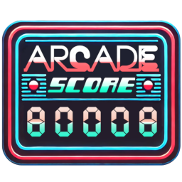

> ⚠ **Work in Progress**  
> This project is still under active development. Features may change, and you may encounter unexpected issues.
> Please report any bugs or feedback via [GitHub Issues](https://github.com/mikedmor/ArcadeScore/issues).

<p align="center">
  
</p>

ArcadeScore is a self-hosted high-score tracking solution designed for arcade enthusiasts. It enables users to track, display, and manage high scores for their personal or shared arcade setups. The project emphasizes flexibility, user customization, and community engagement.

## 🎮 **Features**

- **High Score Tracking**: Seamlessly log and display high scores for multiple games.
- **Multiple Scoreboards**: Create multiple Scoreboard displays, and access all from a single device.
- **Customizable Scoreboard**: Adjust colors, background images, and styles for your arcade scoreboard.
- **User Authentication**: (Optional) Password-protected admin menu for secure settings management.
- **Auto-Scrolling Scoreboard**: Beautiful, auto-scrolling layout showcasing games and scores.
- **Preset Styles & Custom CSS**: Select from 4 preset styles, or create your own with full CSS customization.
- **Self-Hosted Solution**: Maintain complete control over your data and setup.

## 🖼️ **Preview**

### **ArcadeScore Home Page**


<!-- ### **ArcadeScore Scoreboard**
 -->

### **Game Managment**


### **Retrieve Game Artwork**


### **Customize GameCard CSS**


### **Custom Style Presets and Preset Management**


### **Auto-Scrolling Display Demo**


## 🚀 **Planned Features**

- **[hi2txt](https://greatstoneex.github.io/hi2txt-doc/) Support**: Arcade Mame Highscores
- **Game Score Page**: Select a game card to zoom in and see additional details
- **Multiple VPin Studio connections**: Allow multiple VPin Studio connections to a single scoreboard
- **Custom Fonts**: Custom Font installer via Style Menu
- **Manual Score Input**: Feature to enable the ability to manually input scores
- **Password Protected Boards**: Set a password on a board to protect your settings from changes
- **VPin Studio Remote**: Control your pinball tables remotely
- **Public Tournaments**: Participate in global or regional arcade tournaments.
- **Friend Score Syncing**: Compare high scores with friends in real time.

## 🛠 **Requirements**

Before running ArcadeScore, ensure your system meets the following requirements:

### **🔹 Option 1: Running with Docker**
- **Docker**: [Install Docker](https://www.docker.com/get-started)
- **Docker Compose** (included with newer versions of Docker)

### **🔹 Option 2: Running with Python**
- **Python 3.8+** (Ensure it's installed and added to your system PATH)
- **pip** (Included with Python, but can be updated: `python -m ensurepip --default-pip`)
- **7-Zip** (Required for exports)
  - **Windows**: Automatically installed via `setup.bat` if missing
  - **Linux/macOS**: Installed via `setup.sh` (uses `apt` or `yum`)

#### **💡 Additional Notes**
- **Linux/macOS users** may need `sudo` for dependency installations.
- **Ensure port 8080 is available** if running directly via Python.

## 📥 **Installation Instructions**

1. **Clone the Repository**:
    ```bash
    git clone https://github.com/mikedmor/ArcadeScore.git
    cd ArcadeScore
    ```

2. **Create and update .env file**
    Create a .env file following the .env.sample for assistance. Your file should look something like this. If running via docker, ensure your server ip is static on the network, and then include that ip in the SERVER_HOST_IP. 

    ```env
    # BOTH DOCKER OR STANDALONE
    ARCADESCORE_HTTP_PORT=8080

    # WEBHOOK SETUP
    SERVER_HOST_IP=192.168.x.x # Ensure this is static

    # REQUIRED FOR DOCKER
    ## NGINX SERVER
    SERVER_NAME="localhost"
    SSL_PEM=selfsigned.info.pem
    SSL_KEY=selfsigned.info.key

    ## DOCKER MOUNTS
    DOCKER_HTTP_PORT=80
    DOCKER_HTTPS_PORT=443
    ```

3. **Run the software**:

    a. **Set Up Docker** (Recommended):
    Ensure Docker is installed and running on your machine. Build and run the container:
    ```bash
    docker-compose up --build -d
    ```

    To stop the software
    ```bash
    docker-compose down
    ```

    b. **Run via Python**:
    If you prefer running ArcadeScore outside of Docker, follow the setup for your system:

    🖥 Windows:
    Run the following in Command Prompt (cmd):
    ```bash
    setup.bat
    ```

    🐧 Linux/macOS:
    Run the following in Terminal:
    ```bash
    ./setup.sh
    ```

4. **Install Certificates** (Optional):
    If you want to remove the browser warnings when utilizing https urls then you will want to install the certificates so that your computer reconizes them as a "Trusted Root Certification Authority". Follow these steps to do that.

    - In the certs folder find the `selfsigned.crt`
    - right click on this file and select "Install Certificate" (Windows)
    - select "Local Machine" then click Next, allow UAC
    - select "Place all certificates in the following store", then press the browse button
    - Select "Trusted Root Certification Authorities", then press Ok
    - Press Next, then Finish to install the certificate
    - Done, you should now be able to access https://localhost and see the application without a warning

    Note: These steps utilize the included self-signed certificates. If you want more security then it is recommended that you generate your own using OpenSSL
    ```bash
    openssl req -x509 -newkey rsa:4096 -keyout selfsigned.key -out selfsigned.crt -days 365 -nodes -subj "/CN=localhost" && \
      openssl x509 -outform der -in selfsigned.crt -out selfsigned.der && \
      cat selfsigned.key selfsigned.crt > selfsigned.pem
    ```

    Alternatively if you remove these certificats, the system will autogenerate new ones for you (Docker Only), but you will want to pull these from the container and install them on all machines that will access the application 
    
    Note: VPin Studio Server API only communicates via HTTP, however the system has a built in proxy pass to handle this when needed

5. **Access the Application**:
  - Open your browser and navigate to **`http://localhost`**. You should see the landing page.
  - Click the scoreboard to access the **default scoreboard**, or create a new one

6. **Default Setup**:
    The default settings create a sample scoreboard. Customize settings via the admin menu on the scoreboard!

## 🤝 **Contributing**

We welcome contributions from the community! If you’d like to help:

1. **Fork** the repository on GitHub.
2. **Create a new branch** for your feature or bug fix.
3. **Submit a pull request (PR)** with detailed information about your changes.
4. Engage in discussions and improvements in the **Issues** section.

Your contributions make **ArcadeScore** better for everyone!

## ☕ **Donate** 

ArcadeScore is a free, open-source project designed to provide a self-hosted high-score tracking solution for virtual pinball and arcade setups. If you enjoy using ArcadeScore and would like to support its continued development, consider buying me a coffee! 

[](https://ko-fi.com/mikedmor)

Your support helps keep this project alive and improving. Thank you!  

## 🎯 **Goals**

The vision for **ArcadeScore** is to:
- Provide a **robust, open-source** solution for arcade score tracking.
- Foster a **community-driven** approach where users contribute and improve the platform.
- Offer **flexible deployment** options suitable for hobbyists and professional arcade setups.

## 📊 **Progress**

- [ ] Core features
  - [x] **VPin Studio Integration** (via iScored)
    - [x] Table Subscriptions
    - [x] Pulling High Scores
    - [x] Submitting New Scores
  - [x] **VPin Studio 'API' Integration**
    - [x] Create Scoreboard with integration
    - [x] Auto Register for updates (via Webhooks)
     - [x] Option: Create new player when one does not exists
    - [x] Import Games
    - [x] Import Game Media
      - [x] Capture image from mp4 frame
      - [x] Auto rotate playfield for background
      - [x] Compress images to improve load
        - [x] Option to adjust compression settings
      - [x] Option to fallback to vpin studio media if available
    - [x] Import/Update Players
    - [x] Import Scores
  - [x] **Game Management**
    - [x] Game List
    - [x] Hide Games
    - [x] Edit Games
    - [x] Delete Games
    - [x] Add Games
    - [x] Load Details from VPS
    - [x] Score Display Options
    - [x] Custom CSS
    - [x] Preset CSS Templates
    - [x] Copy CSS Between Games
  - [x] **Player Management**
    - [x] Player List
    - [x] Hide Player
    - [x] Edit Player
    - [x] Delete Player
    - [x] Add Player
    - [x] Map multiple initials to a single player
  - [x] **Style Management**
    - [x] Copy Style to All Games
    - [x] Custom CSS Styles
    - [x] Preset CSS Styles
      - [x] 4 Included Styles
        - [x] Default
        - [x] Neon Glow
        - [x] Retro Arcade
        - [x] Cyberpunk
  - [ ] **Integrations Menu**
    - [ ] VPin Studio Integraion
      - [ ] Add/Edit/Delete Multiple VPin Studio Server Connections
      - [ ] Edit VPin Studio Server URL
      - [ ] Edit Webhook Subscriptions
      - [ ] Resync Media
      - [ ] Resync Scores
      - [ ] Add/resync Players
      - [ ] Add/resync Games
  - [x] **Admin Settings**
    - [x] Room Name Customization
    - [x] Date Format Selection
    - [x] Disable Fullscreen Trigger
    - [x] Idle Scroll Toggle & Speed
    - [x] Long Names Enabled
    - [x] Clear Scores Button
    - [x] Clear Games Button
  - [x] **Sockets for Realtime updates**
    - [x] Create Scoreboard VPin Studio Import Progress Socket
    - [x] Score Update Socket
    - [x] Scoreboard change socket
      - [x] Game Adjustments/Changes
      - [x] Game Style Adjustments/Changes
      - [x] Global Style Adjustments/Changes
      - [x] Player Adjustments/Changes
- [x] **Deployment Options**
  - [x] Windows Deployment
  - [x] Linux Deployment
  - [ ] Mac Deployment (Might work using setup.sh 🤷 Let me know)
  - [x] **Dockerized Deployment**
- [x] **Multiple Scoreboards**
- [x] **Improved Landing Page**
- [x] **Mobile Support**
- [x] **Import/Export database and media**
- [x] **Performance Improvements**
  - [x] Improved compression of media (VP Spreadsheet & VPin Studio)

## 🐞 **Known Bugs**
- Vertical score scrolling does not work on mobile
- Drag game reordering is slow when dragging down the list
- Games Menu drag and drop loses shadow placement after first change (refresh fixes it)
- New Player alias default changes when adding new aliases
- Most setting adjustments do not actually work currently
- Deleting players requires a refresh to propigate correctly
- Changing players default alias requires page refresh to propigate
- Selected Style Preset is not remembered when new games are added via webhooks
- Deleting a scoreboard does not inform vpin-studio to remove its webhook

## 📜 **License**

**ArcadeScore** is released under the **[MIT License](LICENSE)**.

---

For support or inquiries, please visit the GitHub repository's [Issues](https://github.com/yourusername/Arcadescore/issues) section.
