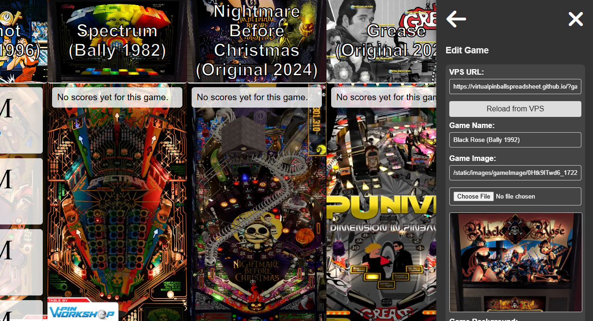

# ArcadeScore

ArcadeScore is a self-hosted high-score tracking solution designed for arcade enthusiasts. It enables users to track, display, and manage high scores for their personal or shared arcade setups. The project emphasizes flexibility, user customization, and community engagement.

## Features

- **High Score Tracking**: Seamlessly log and display high scores for multiple games.
- **Multiple Scoreboards**: Create multiple Scoreboard displays, and access all from a single device.
- **Customizable Dashboard**: Adjust colors, background images, and styles for your arcade dashboard.
- **User Authentication**: (Optional) Password-protected admin menu for secure settings management.
- **Auto-Scrolling Dashboard**: Beautiful, auto-scrolling layout showcasing games and scores.
- **Preset Styles & Custom CSS**: Select from 4 preset styles, or create your own with full CSS customization.
- **Self-Hosted Solution**: Maintain complete control over your data and setup.

## Preview

### 🎮 **ArcadeScore Home Page**


### 🎮 **ArcadeScore Scoreboard**


### 📊 **Game Managment**


### 🎨 **Retrieve Game Artwork**


### 🎨 **Customize GameCard CSS**


### 🎨 **Custom Style Presets and Preset Management**


### 📺 **Auto-Scrolling Display Demo**


## Planned Features

- **Public Tournaments**: Participate in global or regional arcade tournaments.
- **Friend Score Syncing**: Compare high scores with friends in real time.
- **[hi2txt](https://greatstoneex.github.io/hi2txt-doc/) Support**: Arcade Mame Highscores

## Installation Instructions

1. **Clone the Repository**:
    ```bash
    git clone https://github.com/yourusername/ArcadeScore.git
    cd ArcadeScore
    ```

2. **Create and update .env file**
   Create a .env file following the .env.sample for assistance

3. **Set Up Docker**:
    Ensure Docker is installed and running on your machine. Build and run the container:
    ```bash
    docker-compose up --build -d
    ```

4. **Set Up Host**:
    In order to connect this with VPin Studio, you must mimic iScored.info. The simplest way to do this is by updating your Windows HOSTS file to load your server running ArcadeScore:

    - First open notepad, be sure to "Run as Administrator"
    - Next open your HOSTS file, generally found in C:\Windows\System32\drivers\etc\hosts
    - At the end of the file add the following, be sure to replace the ip with the one running your server
    ```bash
    192.168.x.x iscored.info
    192.168.x.x www.iscored.info
    ```

5. **Install Certificates**:
    Another requirement to get this working is to have a valid SSL certificate. This is difficult however since we do not own the domain name iscored.info. Instead what we can do is install the self-signed certificate, but you will need to do this in a few places.

    a. Any device that will access the dashboard webpage
    - in the certs folder find the `iscored.info.crt`
    - right click on this file and select "Install Certificate" (Windows)
    - select "Local Machine" then click Next, allow UAC
    - select "Place all certificates in the following store", then press the browse button
    - Select "Trusted Root Certification Authorities", then press Ok
    - Press Next, then Finish to install the certificate
    - Done, you should now be able to access iscored.info and see the application
    
    b. Any machine running VPin Studio (i.e., VPin Studio Server & Client)
    - Note: You will need to do this on every machine running VPin Studio.
    - You will need the `keytool` Java utility. Install [JDK](https://www.oracle.com/java/technologies/downloads/#jdk23-windows).
    - Ensure that your system `PATH` includes the JDK `/bin` folder. You may need to restart your pc after doing this.
    - Locate the `iscored.info.der` file (for Java).
    - Locate the `cacerts` file for VPin Studio:
      - **VPin Studio Client**: `C:\vPinball\VPin-Studio-Client\win32\java\lib\security\cacerts`
      - **VPin Studio Server**: `C:\vPinball\VPin-Studio\win32\java\lib\security\cacerts`
    - Open a **terminal (as Administrator)** in the folder containing `iscored.info.der` and run:
    ```bash
    keytool -import -trustcacerts -file iscored.info.der -alias iscored_info -keystore <path-to-cacerts>
    ```
    - The password for VPin-Studio cacerts is `changeit`

    These steps utilize the included self-signed certificates. If you want more security then it is recommended that you generate your own using OpenSSL.
    ```bash
    openssl req -x509 -newkey rsa:4096 -keyout cert.key -out cert.crt -days 365 -nodes -subj "/CN=iscored.info" && \
      openssl x509 -outform der -in cert.crt -out cert.der && \
      cat cert.key cert.crt > cert.pem
    ```

    Make sure you replace the .crt, .der, .key, and .pem files in the cert folder before running `docker-compose up --build -d` otherwise this will not work!

6. **Access the Application**:
    - Open your browser and navigate to **`https://iscored.info`**. You should see the landing page.
   - Click the button to access the **default dashboard**.
   - Open **VPin Studio** and go to the **Competitions page**.
   - Switch to the **iScored Subscriptions** tab.
   - Click **Add Subscription** and enter the following URL:
     ```
     https://www.iscored.info/default
     ```
   - Click **Refresh** to load available tables. 
   - If a table does not appear, ensure that the corresponding game is installed in VPin Studio.

7. **Default Setup**:
    The default settings create a sample dashboard. Customize settings via the admin menu on the dashboard!

## Contributing

We welcome contributions from the community! If you’d like to help:

1. **Fork** the repository on GitHub.
2. **Create a new branch** for your feature or bug fix.
3. **Submit a pull request (PR)** with detailed information about your changes.
4. Engage in discussions and improvements in the **Issues** section.

Your contributions make **ArcadeScore** better for everyone!

## Goals

The vision for **ArcadeScore** is to:
- Provide a **robust, open-source** solution for arcade score tracking.
- Foster a **community-driven** approach where users contribute and improve the platform.
- Offer **flexible deployment** options suitable for hobbyists and professional arcade setups.

## Progress

- [x] Core features implemented
  - [x] **VPin Studio Integration** (via iScored)
    - [x] Table Subscriptions
    - [x] Pulling High Scores
    - [x] Submitting New Scores
  - [x] **Game Management**
    - [x] Game List
    - [x] Hide Games
    - [x] Edit Games
    - [x] Delete Games
    - [x] Add Games
    - [x] Load Details from VPS
    - [x] Score Display Options
    - [ ] Reverse Sort
    - [x] Custom CSS
    - [x] Preset CSS Templates
    - [x] Copy CSS Between Games
  - [ ] **Player Management**
    - [x] Player List
    - [ ] Hide Player
    - [ ] Edit Player
    - [ ] Delete Player
    - [x] Add Player
    - [x] Map multiple initials to a single player
  - [ ] **Style Management**
    - [x] Copy Style to All Games
    - [x] Custom CSS Styles
    - [x] Preset CSS Styles
      - [ ] 4 Included Styles
        - [x] Default
        - [ ] ?????
        - [ ] ?????
        - [ ] ?????
    - [ ] Font Installer
  - [ ] **Admin Settings**
    - [ ] Room Name Customization
    - [ ] Date Format Selection
    - [ ] Enable/Disable Manual Score Input
    - [ ] Auto Refresh Toggle
    - [ ] Disable Fullscreen Trigger
    - [ ] Idle Scroll Toggle & Speed
    - [ ] Long Names Enabled
    - [ ] Database Import/Export
    - [ ] Password Protection
- [x] **Dockerized Deployment**
- [x] **Multiple Dashboards**
- [x] **Mobile Support**
- [ ] **[hi2txt](https://greatstoneex.github.io/hi2txt-doc/) MAME Support** *(Looking for assistance!)*
- [x] **Improved Landing Page**
- [ ] **Performance Improvements**
- [ ] **Tournaments**
  - [ ] Private Tournament Bracket
  - [ ] Public Tournament Bracket (SYNC)
- [ ] **Sync with Friends (SYNC)**

## Known Bugs
- Vertical score scrolling does not work on mobile
- Drag game reordering is slow when dragging down the list
- New Player alias default changes when adding new aliases
- Most setting adjustments do not actually work currently

## VPin Studio

I have interest in assisting to create a "true" integration with VPin Studio.

## License

**ArcadeScore** is released under the **[MIT License](LICENSE)**.

---

For support or inquiries, please visit the GitHub repository's [Issues](https://github.com/yourusername/Arcadescore/issues) section.
